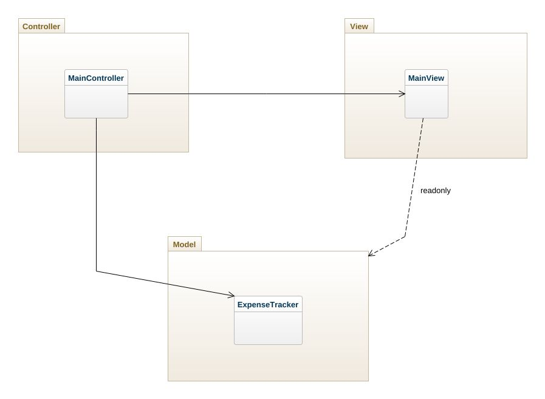

# expense-tracker

Expense-Tracker är en applikation som riktar sig till alla som hanterar utgifter på något sätt, det kan handla om att få veckopengen att räcka eller att få vardagen att fungera samtidigt som låneräntor ska betalas. Läs mer om applikationen i Visions-dokumentet:

[Vision](https://github.com/AnJson/expense-tracker/wiki/Vision)


## Applikationen

Starta applikationen:

```node
npm run dev
```

Applikationen är byggd med en Model-View-Controller arkitektur.



### Version

#### Nuvarande version

Nuvarande version är en Minimum Viable Product som läser in den nuvarande veckan, om den redan finns lagrad i **minnet* hämtas veckan med alla utgifter därifrån, och visar en lista med veckans dagar med datum, utgifter med kategori och en total summa för dagen. Man kan lägga till utgifter per kategori för varje dag och man kan få en överblick av veckans utgifter i ett stapeldiagram med metadata.
Vilka kategorier som finns att välja beror på vilka som finns lagrade i **minnet*.

**Minnet i denna version är hårdkodade objekt som håller minnet under sessionen. Kommunikation med minnet inifrån applikationen sker mot ett interface/boundary och behöver inte förrändras när lagringen byts ut på persistent lagring.*


#### Kommande versioner

Funktionallitet som kommer läggas till i framtida versioner av applikationen läser du mer om i [visionen](https://github.com/AnJson/expense-tracker/wiki/Vision) och i [kravlistan](https://github.com/AnJson/expense-tracker/issues)

### Test

Applikationen testas manuellt och testspecification finns här:

[Testspecification](https://github.com/AnJson/expense-tracker/wiki/Testspecification)

### Dependencies

[`@anjson/stats-charts`](https://www.npmjs.com/package/@anjson/stats-charts) - För att illustrera diagram med metadata.

[`date-fns`](https://www.npmjs.com/package/date-fns) - För att hantera datum inklusive veckonummer.

[`nanoid`](https://www.npmjs.com/package/nanoid) - För att generera unika id.


