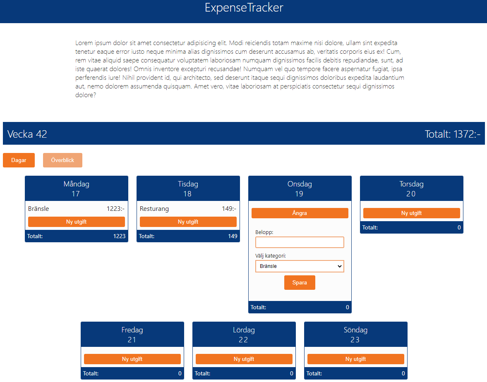
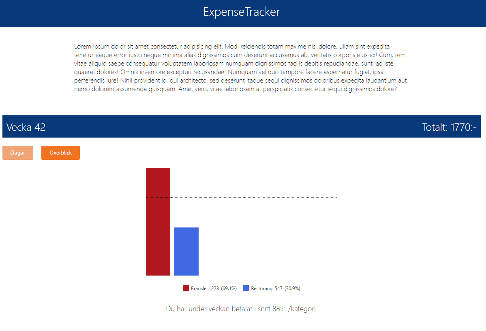

# expense-tracker

Expense-Tracker är en applikation som riktar sig till alla som hanterar utgifter på något sätt, det kan handla om att få veckopengen att räcka eller att få vardagen att fungera samtidigt som låneräntor ska betalas. Genom att illustrera utgifter i diagram gör Expense-Tracker det lätt att få en överblick över sina utgifter, hur mycket pengar spenderar jag under en vecka och på vad.

## Applikationen

1. Starta applikationen:

```node
npm run dev
```

2. Nuvrande veckas dagar och datum visas, och det går att lägga till utgifter för varje dag. Dagens totala summa för utgifter visas och hela veckans totala utgifter ökar varje gång en utgift läggs till.



3. I överblicksvyn illustreras veckans utgifter i ett stapeldiagram där varje stapel i diagrammet är en kategori av utgift och höjden på stapeln är den totala summan av utgifter inom kategorin under veckan.




